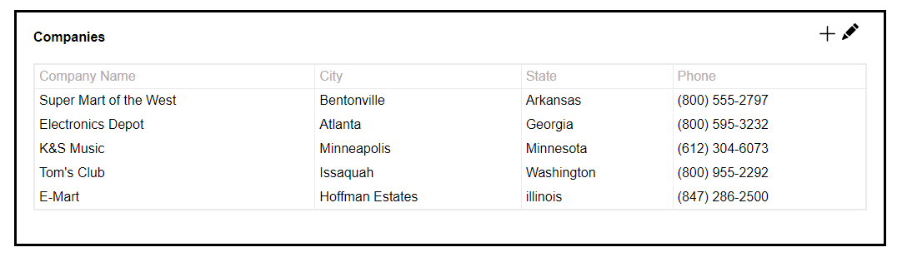
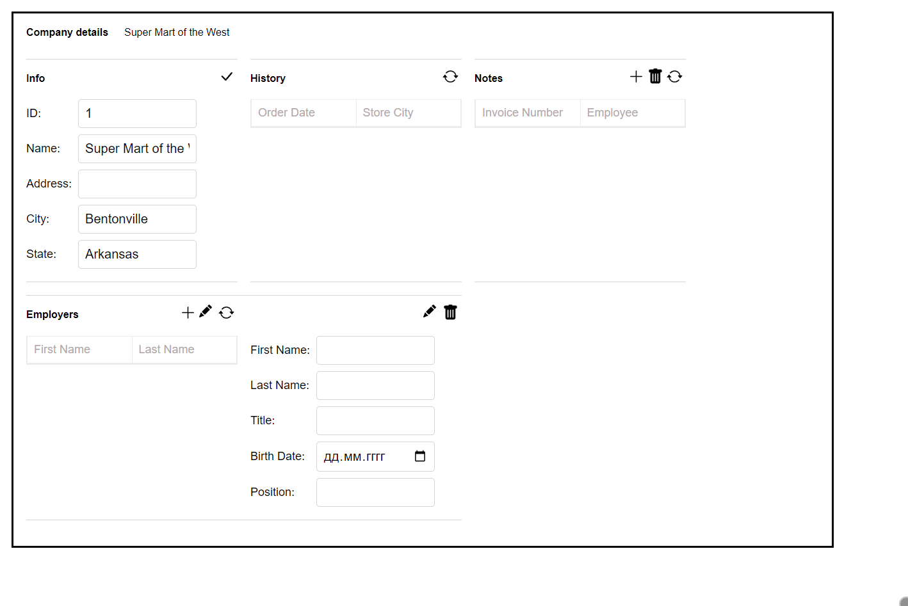
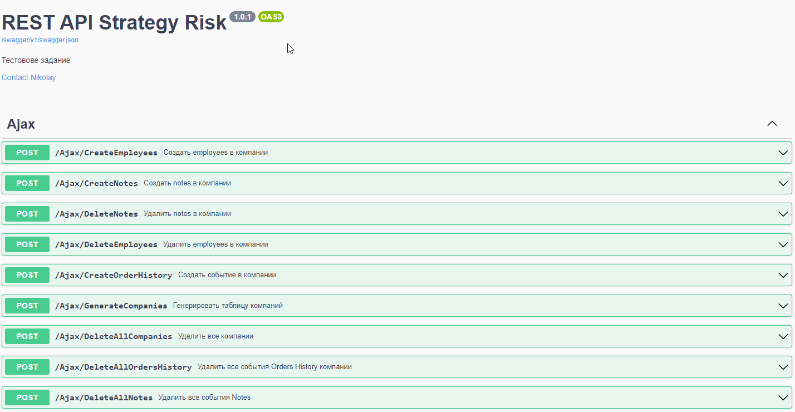
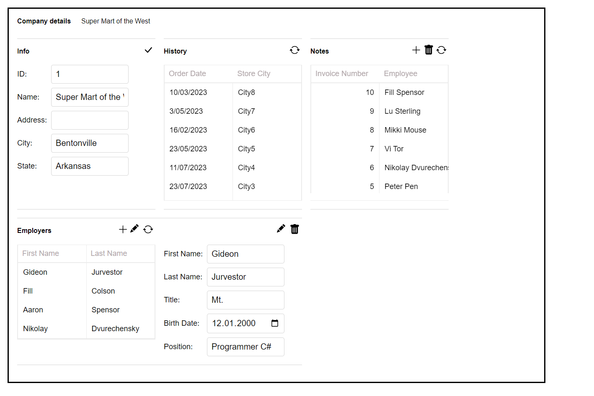
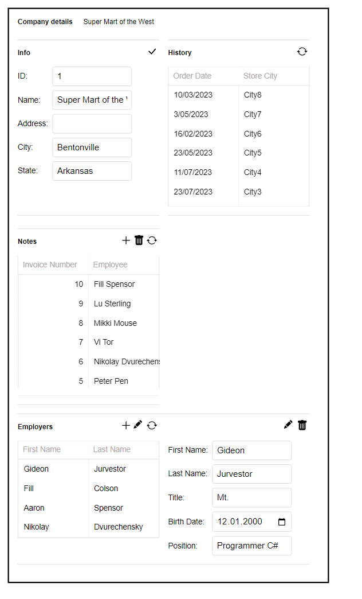
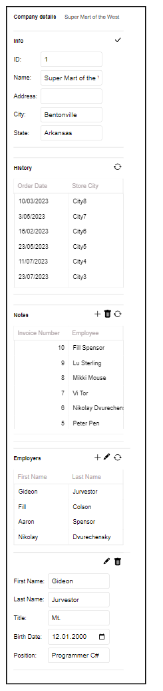

<p align="center">
  
  <p align="center">
    <a href="https://sites.google.com/view/dvurechensky" target="_blank"></a>
    
    
    
    
    
    
  </p>
</p>

<h1 align="center"> <g-emoji class="g-emoji" alias="crystal_ball" fallback-src="https://github.githubassets.com/images/icons/emoji/unicode/1f52e.png">🔮</g-emoji> Тестовое задание компании Стратегия Рийска (Владикавказ)</h1>
<p align="center"><b>🎯SCAM</b> вакансия <b><i>HeadHunter</i></b></p>

<div align="center" style="margin: 20px 0; padding: 10px; background: #1c1917; border-radius: 10px;">
  <strong>🌐 Язык: </strong>
  
  <span style="color: #F5F752; margin: 0 10px;">
    ✅ 🇷🇺 Русский (текущий)
  </span>
  | 
  <a href="./README.md" style="color: #0891b2; margin: 0 10px;">
    🇺🇸 English
  </a>
</div>

---

# ✨ Оглавление

- [✨ Оглавление](#-оглавление)
  - [✨ Запуск](#-запуск)
    - [🚀 Требования системы для запуска:](#-требования-системы-для-запуска)
    - [🚀 Требования системы для разработки:](#-требования-системы-для-разработки)
  - [✨ Технические характеристики](#-технические-характеристики)
  - [✨ Требования задания](#-требования-задания)
  - [🤖 Результат выполнения](#-результат-выполнения)
  - [👾 Важно отметить](#-важно-отметить)

## ✨ Запуск

### 🚀 Требования системы для запуска:

1. Visual Studio 2022

### 🚀 Требования системы для разработки:

> для функционирования встроенного Grunt в проекте

1. Выгрузить папку node_modules из проекта
2. В PowerShell в корне проекта ввести команду

```bash
cmd /c mklink /D node_modules node_modules
```

3. Перезапустить проект

## ✨ Технические характеристики

- Backend
  - ASP NET MVC
- Frontend
  - Typescript
- Database
  - EntityFrameworkCore

## ✨ Требования задания

> The text in the "Company Name" column should be a link that opens "Details" for its
> object

1. Текст в столбце «Название компании» должен быть ссылкой, которая открывает «Подробности» компании
   > Use EntityFramework, store data in memory (add a code that creates initial data at
   > application startup)
2. Используйте EntityFramework, храните данные в памяти (добавьте код, создающий исходные данные в
   запуск приложения)
   > Set a fixed width for groups in "Details"
3. Установите фиксированную ширину для групп в разделе «Подробности».
   > Use CSS Flex to align groups in "Details", there should be 1 column of groups if browser
   > window is narrow
4. Используйте CSS Flex для выравнивания групп в разделе "Подробности", должен быть 1 столбец групп, если окно браузера узкое
   > Use CSS Grid to align items in groups in "Details"
5. Используйте CSS Grid для выравнивания элементов в группах в разделе «Подробности».
   > Avoid duplication of CSS and HTML markup code that generates "Details" in C#/markup
   > code (each group should have the same layout for the 'caption', 'toolbar' and 'content'
   > items)
6. Избегайте дублирования кода разметки CSS и HTML, который генерирует «Подробности» в C#/разметке.
   код (каждая группа должна иметь одинаковый макет для объектов «заголовка», «панели инструментов» и «контента»)
   > Implement behavior for 'Refresh' button: reload data from the server and recreate DOM
   > in browser
7. Реализовать поведение кнопки «Обновить»: перезагрузить данные с сервера и заново создать DOM.
   в браузере
   > Adjust the "Employees" group to be nearly twice wider than other groups, keep vertical
   > groups alignment
8. Отрегулируйте группу "Сотрудники", чтобы она была почти в два раза шире, чем другие группы, сохраняя вертикальность
   выравнивание групп
   > Don't render grids on the server side. Instead, render an empty grid and perform a new
   > 'fetch' request when a page is loaded and build grid rows in javascript code, in browser.
   > Implement necessary server side API to load data for grids
9. Не визуализируйте сетки на стороне сервера. Вместо этого визуализируйте пустую сетку и выполните новую
   запрос «выборки» при загрузке страницы и построение строк сетки в коде javascript в браузере.
   Реализовать необходимый API на стороне сервера для загрузки данных для сеток.

## 🤖 Результат выполнения

<p align="center">
  <h1 align="center">👨🏽‍💻 Версия на ПК</h1>
  <h5 align="center">💫 Main 💫</h5>
  
  <h5 align="center">💫 Details 💫</h5>
  
  <h1 align="center">👨🏽‍💻 Для заполнения групп создано REST API</h1>
  
  <h1 align="center">👨🏽‍💻 Пример заполненной версии 💫Details💫</h1>
  
  <h1 align="center">👨🏽‍💻 Пример мобильной версии 💫Details💫</h1>
  <h5 align="center">💫 870px 💫</h5>
  <p align="center">
    
  </p>
  <h5 align="center">💫 500px 💫</h5>
  <p align="center">
    
  </p>
</p>

## 👾 Важно отметить

- В задаче не была описана логика работы кнопок редактирования и поведение кнопки добавления
- В задаче не затрагивались вопросы ограничения по стеку технологий применяемых для ускорения разработки
- В задаче нету пунктов о сложности или простоте исполнения, конкретного формата выполнения работы не указано
- Бонусом в задаче реализована поддержка TypeScript и автоматическая генерация JavaScript и CSS сразу в минимизированный формат
- Бонусом в задаче сделано API способное принимать пачки данных на обработку

<p align="center">✨Dvurechensky✨</p>
